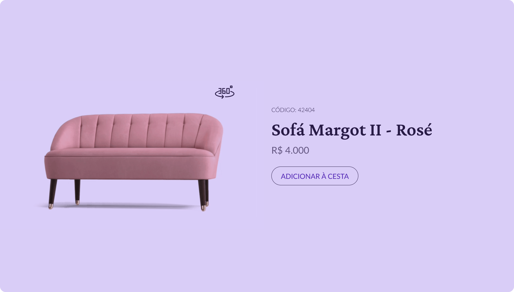

# Desafio 02 - Rocketseat Ignite - React

## 👨‍💻 Sobre este repositório

Esse repositório faz parte do desafio 2 do site [boracodar.dev](https://boracodar.dev). Foi desenvolvido utilizando Next.JS + Tailwind CSS. 

Eestá disponível para visualização [clicando aqui](https://boracodar-desafio2.vercel.app/)

